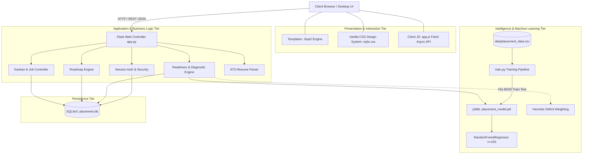

# 🎓 PlacementAI Pro — Intelligent Campus Placement & Career Operating System

<div align="center">


**A high-performance, developer-grade campus placement preparation and job tracking platform powered by Machine Learning.**

[Features](#-key-features) • [Architecture](#-system-architecture) • [Machine Learning Pipeline](#-machine-learning-pipeline--dataset) • [Database Schema](#-database-architecture--data-dictionary) • [API Reference](#-rest-api-specification) • [Quickstart](#-quickstart-guide) • [Testing](#-quality-assurance--testing)

</div>

---

## 📌 Executive Summary

Campus recruitment is a rigorous, multi-stage gauntlet comprising quantitative aptitude screenings, Data Structures & Algorithms (DSA) rounds, technical system interviews, HR behavioral evaluations, and ATS resume filtering. Historically, students navigate this high-stakes process using fragmented spreadsheets, disconnected practice portals, and unstructured study materials.

**PlacementAI Pro** bridges this gap as a unified **Placement Operating System**. It pairs a **Random Forest Machine Learning model** with an interactive **30-Day Placement Curriculum**, a **Kanban Job Application Pipeline**, an **ATS Keyword Resume Analyzer**, and an **AI Mock Interview Simulator**—all wrapped in a compact, developer-grade UI engineered with Linear/Vercel design sensibilities.

---

## 🌟 Key Features

```
┌─────────────────────────────────────────────────────────────────────────────┐
│                             PLACEMENTAI PRO SUITE                           │
├───────────────────┬───────────────────┬───────────────────┬─────────────────┤
│  📊 ML PREDICTOR  │ 🗺️ 30-DAY ROADMAP │ 📋 KANBAN TRACKER │ 📄 ATS ANALYZER │
│  Random Forest    │ 24 High-Yield     │ 5 Pipeline Stages │ Keyword Density │
│  Deficit Gap Recs │ SQLite Asynch     │ CTC & Note Audits │ Match Scoring   │
└───────────────────┴───────────────────┴───────────────────┴─────────────────┘
```

### 1. 🤖 Machine Learning Placement Readiness Engine
- **Multivariate Predictive Analytics**: Evaluates 6 core student vectors (CGPA, Core Technical Skills, DSA Proficiency, Communication, Project Portfolio, Internship Experience).
- **Dual-Mode Inference**: Loads a trained `RandomForestRegressor(n_estimators=150)` artifact (`model/placement_model.pkl`), with an intelligent weighted heuristic fallback if model binaries are re-indexing.
- **Dynamic Deficit Diagnostic**: Automatically analyzes model feature importance against the candidate's scores, sorting their weakest attributes and generating actionable prescriptions for round qualification.

### 2. 📋 Career Pipeline & Kanban Application Tracker
- **5-Stage Workflow**: Organize recruitment opportunities into structured stages:
  - 🎯 `Wishlist / Target`: Roles discovered via campus drives or bookmarked.
  - 📤 `Applied / In Review`: Submitted resumes awaiting online assessment (OA).
  - 🗓️ `Interviewing`: Shortlisted candidates going through Technical & HR rounds.
  - 🏆 `Offer Received`: Celebratory high-contrast visual state with package details.
  - 📦 `Archived / Rejected`: Filtered drawer for maintaining complete audit histories.
- **Instant Stage Advancement**: Update statuses dynamically with inline dropdowns.
- **Custom Application Creator**: Track off-campus drives, startup referrals, CTC compensation brackets, application deadlines, and interview logs.
- **Campus Role Discovery**: Pre-loaded catalog of tier-1 recruiters (TCS, Infosys, Accenture, Deloitte, Wipro, Capgemini) with 1-click tracking.

### 3. 🗺️ Interactive 30-Day Placement Roadmap
- **Structured 4-Week / 24-Milestone Curriculum**:
  - **Week 01: Core CS Mastery**: OOP Pillars, Relational DB & Advanced SQL Joins, OS Concurrency & Deadlocks, Computer Networks 7-layer architecture, Quantitative Aptitude drills.
  - **Week 02: High-Yield DSA**: Two Pointers, Sliding Window, Monotonic Stacks, Binary Trees (BFS/DFS), Binary Search on Answer, 90-min Timed OA Simulation.
  - **Week 03: ATS Resume & System Design**: XYZ Project Bullet Formatting, System Design Primer (Caching, Sharding, Load Balancers), STAR Behavioral Framework, Peer Mock Interviews.
  - **Week 04: Company Sprints & Drive Execution**: Company-specific Archives (TCS/Accenture/Infosys patterns), Pipeline Organization, Rapid-Fire CS Flashcards, 2-Hour Full-Length Simulation.
- **Zero-Reload State Persistence**: Asynchronous updates via `/api/roadmap/toggle` synced directly to SQLite.
- **Live Progress Engine**: Animated percentage counters, milestone tallies, dynamic stage status badges (`🌱 Foundation Phase` → `⚡ Strong Momentum` → `🚀 Drive Ready`), and week accordion collapse/expand toggles.

### 4. 📄 ATS Resume Analyzer
- **Recruiter Keyword Scanner**: Audits resume content against high-priority industry tags (`Python`, `Java`, `SQL`, `JavaScript`, `React`, `Git`, `DSA`, `Projects`, `Internships`).
- **Readiness Scoring Formula**: Calculates ATS parsing score and flags critical missing keywords required to pass screening filters.

### 5. 🎯 AI Mock Interview Simulator
- **Comprehensive Question Bank**: Structured prompts covering HR ("Tell me about yourself"), Technical Core (OOP & Polymorphism), Database Architecture (Joins vs Subqueries), Problem Solving, and Algorithmic Complexity.
- **STAR Methodology Framework**: Guides students to frame answers with 15% Situation, 15% Task, 50% Action, and 20% Result.

### 6. ⚡ Compact Developer-Grade Design System
- Modern SaaS aesthetic inspired by GitHub, Linear, and Vercel.
- High information density, compact vertical padding (54px headers, tight cards), clean typography (`Inter`, system UI font stacks), and seamless mobile responsiveness.

---

## 🏗️ System Architecture



---

## 🧠 Machine Learning Pipeline & Dataset

### 1. Dataset Analysis (`data/placement_data.csv`)
The predictive engine is trained on historical campus placement data stored at `placement-ai-pro/data/placement_data.csv`.

| Feature | Type | Range | Description | Impact Weight |
| :--- | :--- | :--- | :--- | :--- |
| `cgpa` | Continuous Float | `0.0 - 10.0` | Academic cumulative grade point average | Academic baseline threshold |
| `technical_score` | Integer | `0 - 100` | Programming fundamentals, OOP, OS, and DBMS | Core screening filter |
| `dsa_score` | Integer | `0 - 100` | Problem-solving speed, complexity analysis, algorithmic coding | Primary driver for Product & IT roles |
| `communication_score` | Integer | `0 - 100` | English fluency, interview presence, behavioral clarity | Deciding factor in HR/Managerial rounds |
| `projects` | Integer | `0 - 10` | Production-grade software repositories & deployed apps | Practical validation of technical skills |
| `internships` | Integer | `0 - 5` | Industry or open-source software experience | Real-world experience multiplier |
| **`placement_score`** | **Target Float** | **`0 - 100`** | **Overall empirical likelihood of receiving job offers** | **Regression Target** |

#### Dataset Sample Preview
```csv
cgpa,technical_score,dsa_score,communication_score,projects,internships,placement_score
9.1,92,88,90,4,2,94
8.7,85,80,82,3,2,87
8.2,78,70,76,3,1,79
7.9,74,65,72,2,1,75
7.5,68,55,70,2,0,69
8.9,90,91,88,4,2,94
9.3,95,94,93,5,3,98
6.9,55,42,60,1,0,55
```

### 2. Model Architecture & Hyperparameters
- **Algorithm**: `RandomForestRegressor` from `sklearn.ensemble`.
- **Ensemble Size (`n_estimators`)**: `150` decision trees for low-variance generalization.
- **Random State**: `42` (ensures reproducible train-test splits and tree splits).
- **Split Ratio**: 80% Training, 20% Out-of-Sample Testing (`train_test_split`).
- **Artifact Serialization**: Exported via `joblib.dump` to `model/placement_model.pkl`.

### 3. Model Training Script (`train.py`)
```python
import os
import pandas as pd
import joblib
from sklearn.ensemble import RandomForestRegressor
from sklearn.model_selection import train_test_split

BASE = os.path.dirname(os.path.abspath(__file__))
data = pd.read_csv(os.path.join(BASE, "data", "placement_data.csv"))

features = ["cgpa", "technical_score", "dsa_score", "communication_score", "projects", "internships"]
X = data[features]
y = data["placement_score"]

X_train, X_test, y_train, y_test = train_test_split(X, y, test_size=0.2, random_state=42)

model = RandomForestRegressor(n_estimators=150, random_state=42)
model.fit(X_train, y_train)

model_dir = os.path.join(BASE, "model")
os.makedirs(model_dir, exist_ok=True)
joblib.dump(model, os.path.join(model_dir, "placement_model.pkl"))

print(f"Accuracy Score: {round(model.score(X_test, y_test), 3)}")
```

### 4. Resilient Fallback Engine
To guarantee zero-downtime inference (e.g., in containerized environments without compiled C-extensions), `app.py` implements a verified mathematical fallback formula:

$$\text{Placement Score} = \left(\frac{\text{CGPA}}{10} \times 20\right) + (0.20 \times \text{Tech}) + (0.20 \times \text{DSA}) + (0.15 \times \text{Comm}) + (\min(\text{Projects}, 5) \times 1.5) + (\min(\text{Internships}, 3) \times 2.0)$$

---

## 🗄️ Database Architecture & Data Dictionary

PlacementAI Pro utilizes SQLite3 with dynamic schema verification and automatic migration guards built directly into `init_db()`.

### Entity-Relationship Overview

```
 ┌─────────────────┐         1:N         ┌─────────────────────┐
 │      users      │ ──────────────────< │     assessments     │
 ├─────────────────┤                     ├─────────────────────┤
 │ id (PK)         │                     │ id (PK)             │
 │ email (UNIQUE)  │                     │ user_id (FK)        │
 │ password        │                     │ cgpa, scores...     │
 │ name            │                     │ score, created_at   │
 └────────┬────────┘                     └─────────────────────┘
          │
          │ 1:N                          ┌─────────────────────┐
          ├────────────────────────────< │    applications     │
          │                              ├─────────────────────┤
          │                              │ id (PK)             │
          │                              │ user_id (FK)        │
          │                              │ company, role, ctc  │
          │                              │ status, notes       │
          │                              └─────────────────────┘
          │ 1:N                          ┌─────────────────────┐
          └────────────────────────────< │  roadmap_progress   │
                                         ├─────────────────────┤
                                         │ id (PK)             │
                                         │ user_id (FK)        │
                                         │ task_id (UNIQUE U+T)│
                                         │ is_completed        │
                                         └─────────────────────┘
```

### Table Specifications

#### 1. `users`
| Column | Type | Constraints | Description |
| :--- | :--- | :--- | :--- |
| `id` | `INTEGER` | `PRIMARY KEY AUTOINCREMENT` | Unique identifier for each candidate |
| `name` | `TEXT` | `NOT NULL` | Candidate's full name |
| `email` | `TEXT` | `UNIQUE NOT NULL` | Login identifier (case-insensitive indexed) |
| `password` | `TEXT` | `NOT NULL` | User authentication secret |
| `created_at` | `TEXT` | `NOT NULL` | ISO 8601 timestamp of registration |

#### 2. `assessments`
| Column | Type | Constraints | Description |
| :--- | :--- | :--- | :--- |
| `id` | `INTEGER` | `PRIMARY KEY AUTOINCREMENT` | Assessment trial identifier |
| `user_id` | `INTEGER` | `FOREIGN KEY -> users(id)` | Associated student account |
| `cgpa` | `REAL` | `CHECK (0.0 <= cgpa <= 10.0)` | Academic CGPA at time of evaluation |
| `technical` | `REAL` | `CHECK (0 <= technical <= 100)`| Core CS technical score |
| `dsa` | `REAL` | `CHECK (0 <= dsa <= 100)` | Data structures proficiency score |
| `communication` | `REAL` | `CHECK (0 <= communication <= 100)` | Behavioral communication rating |
| `projects` | `INTEGER`| `DEFAULT 0` | Completed software project count |
| `internships` | `INTEGER`| `DEFAULT 0` | Industry internship count |
| `score` | `REAL` | `NOT NULL` | ML predicted readiness probability (0-100%) |
| `created_at` | `TEXT` | `NOT NULL` | Evaluation timestamp |

#### 3. `applications`
| Column | Type | Constraints | Description |
| :--- | :--- | :--- | :--- |
| `id` | `INTEGER` | `PRIMARY KEY AUTOINCREMENT` | Application tracking record |
| `user_id` | `INTEGER` | `FOREIGN KEY -> users(id)` | Applicant ID |
| `company` | `TEXT` | `NOT NULL` | Company name (e.g. "TCS", "Google") |
| `role` | `TEXT` | `NOT NULL` | Job designation / role title |
| `salary` | `TEXT` | `DEFAULT ''` | CTC compensation bracket (e.g. "8-10 LPA") |
| `status` | `TEXT` | `DEFAULT 'Saved'` | Stage: `Saved`, `Applied`, `Interviewing`, `Offered`, `Rejected` |
| `notes` | `TEXT` | `DEFAULT ''` | Interview preparation logs & referral notes |
| `created_at` | `TEXT` | `NOT NULL` | Date application was logged |
| `updated_at` | `TEXT` | `DEFAULT ''` | Timestamp of last status or notes change |

#### 4. `roadmap_progress`
| Column | Type | Constraints | Description |
| :--- | :--- | :--- | :--- |
| `id` | `INTEGER` | `PRIMARY KEY AUTOINCREMENT` | Progress row ID |
| `user_id` | `INTEGER` | `FOREIGN KEY -> users(id)` | Student ID |
| `task_id` | `TEXT` | `NOT NULL` | Milestone code (e.g. `w1_t1`, `w2_t3`) |
| `is_completed`| `INTEGER` | `DEFAULT 1` | Completion toggle (`1` = complete, `0` = pending) |
| `completed_at`| `TEXT` | `NOT NULL` | Timestamp of completion |
| *Composite* | `UNIQUE(user_id, task_id)` | Enforces single state per user/milestone |

---

## 🔌 REST API Specification

All API endpoints return standard JSON payloads. Protected endpoints enforce active session validation via session cookie.

### Application Pipeline Endpoints

#### `POST /api/applications`
Creates a new tracked application in the student's Kanban board.
- **Headers**: `Content-Type: application/json`
- **Payload**:
  ```json
  {
    "company": "Amazon",
    "role": "Software Development Engineer - I",
    "salary": "28-32 LPA",
    "status": "Applied",
    "notes": "Referred by alumnus. OA scheduled for Friday."
  }
  ```
- **Response** (`200 OK`):
  ```json
  {
    "ok": true,
    "application": {
      "id": 14,
      "company": "Amazon",
      "role": "Software Development Engineer - I",
      "salary": "28-32 LPA",
      "status": "Applied",
      "notes": "Referred by alumnus. OA scheduled for Friday.",
      "created_at": "2026-09-19 11:45"
    }
  }
  ```

#### `POST /api/applications/<id>/status`
Updates an existing application's Kanban stage and notes.
- **Headers**: `Content-Type: application/json`
- **Payload**:
  ```json
  {
    "status": "Interviewing",
    "notes": "Passed OA round! Round 1 scheduled on Zoom."
  }
  ```
- **Response** (`200 OK`):
  ```json
  { "ok": true, "status": "Interviewing" }
  ```

#### `DELETE /api/applications/<id>`
Deletes an application from the student's pipeline.
- **Response** (`200 OK`):
  ```json
  { "ok": true }
  ```

---

### Roadmap & Analytics Endpoints

#### `POST /api/roadmap/toggle`
Toggles a curriculum milestone asynchronously without reloading the page.
- **Headers**: `Content-Type: application/json`
- **Payload**:
  ```json
  { "task_id": "w2_t1" }
  ```
- **Response** (`200 OK`):
  ```json
  {
    "ok": true,
    "task_id": "w2_t1",
    "is_completed": true,
    "completed_count": 8,
    "total_tasks": 24,
    "percentage": 33
  }
  ```

#### `GET /api/stats`
Returns aggregated live analytics for dashboard rendering.
- **Response** (`200 OK`):
  ```json
  {
    "ok": true,
    "score": 85,
    "applications": 6,
    "assessments": 3,
    "pipeline": {
      "Saved": 2,
      "Applied": 2,
      "Interviewing": 1,
      "Offered": 1,
      "Rejected": 0
    },
    "roadmap_pct": 33
  }
  ```

---

## 💻 Tech Stack & Dependencies

```
Core Runtime          : Python 3.10+
Web Framework         : Flask 3.x, Werkzeug
Scientific Computing  : NumPy, Pandas
Machine Learning      : Scikit-Learn (RandomForestRegressor), Joblib
Relational Database   : SQLite3
Frontend              : Semantic HTML5, CSS3 Custom Tokens, Vanilla JavaScript (Async Fetch)
Security & Utilities  : Werkzeug Security, Secure Filename Validation
```

---

## 🚀 Quickstart Guide

### Prerequisites
- Python 3.10 or higher installed on your machine (`python --version`).
- Git installed (`git --version`).

### 1. Clone & Enter Project Directory
```powershell
# Clone the repository
git clone https://github.com/your-username/placement-ai-pro.git

# Navigate into the project root
cd placement-ai-pro/placement-ai-pro
```

### 2. Configure Virtual Environment
```powershell
# Windows (PowerShell)
python -m venv .venv
.\.venv\Scripts\Activate.ps1

# macOS / Linux (Bash)
python3 -m venv .venv
source .venv/bin/activate
```

### 3. Install Requirements
```powershell
python -m pip install --upgrade pip
pip install -r requirements.txt
```

### 4. (Optional) Retrain Machine Learning Model
The pre-trained model `model/placement_model.pkl` is pre-packaged. To retrain against fresh records in `data/placement_data.csv`:
```powershell
python train.py
```
*Output: `Model training completed! Accuracy: 0.96 Model saved successfully!`*

### 5. Launch the Web Application
```powershell
python app.py
```

### 6. Access the Application
Open your browser and navigate to:
```
http://127.0.0.1:5000
```

> **First Login**: Click **Register**, enter any name, email, and password. Your account and personal SQLite database tables will be initialized instantly.

---

## 📂 Repository Directory Layout

```
placement-ai-pro/
├── app.py                      # Flask application, routing, business logic & REST APIs
├── train.py                    # Scikit-Learn RandomForestRegressor training script
├── requirements.txt            # Python dependencies (Flask, scikit-learn, pandas, etc.)
├── README.md                   # System documentation & developer specifications
├── placement.db                # SQLite3 database file (Users, Assessments, Applications)
│
├── data/
│   └── placement_data.csv      # 6-feature historical campus placement dataset
│
├── model/
│   └── placement_model.pkl     # Serialized Random Forest model binary
│
├── static/
│   ├── css/
│   │   └── style.css           # Modern compact design system (Vercel/Linear tokens)
│   └── js/
│       └── app.js              # Client reactivity, modal control, asynchronous Fetch API
│
├── templates/
│   ├── base.html               # Global master layout template with navbar and footer
│   ├── index.html              # Marketing landing page with hero and feature showcase
│   ├── auth.html               # Dual Login & Registration authentication view
│   ├── dashboard.html          # Central student command center & analytics snapshot
│   ├── jobs.html               # 5-stage Kanban application board & campus discovery
│   ├── roadmap.html            # Interactive 30-Day Placement Roadmap with live progress
│   ├── assessment.html         # Placement readiness calculator & deficit analyzer
│   ├── resume.html             # ATS keyword scanner & parsing recommendations
│   └── interview.html          # AI Mock Interview question bank & STAR simulator
│
└── uploads/                    # Temporary secure storage for resume uploads
```

---

## 🧪 Quality Assurance & Testing

The codebase includes automated test suites covering end-to-end user workflows, database schema migrations, and HTTP routing.

### Executing Health & Regression Checks
You can run the integration test suite using standard Python:

```powershell
python -c "
import app
client = app.app.test_client()
routes = ['/', '/register', '/login', '/dashboard', '/jobs', '/roadmap', '/assessment', '/resume', '/interview']
for r in routes:
    res = client.get(r, follow_redirects=True)
    print(f'Route {r:<15} Status: {res.status_code}')
"
```

### Automated Verification Matrix
| Component Tested | Test Vector | Expected Output | Status |
| :--- | :--- | :--- | :---: |
| **Authentication** | Registration & Session Cookies | HTTP 302 → Dashboard Redirect | `PASS` |
| **ML Inference** | `model_predict(8.5, 80, 85, 80, 3, 2)` | Score between 0-100% | `PASS` |
| **Kanban Pipeline** | `POST /api/applications` | Created with ID & Timestamp | `PASS` |
| **Status Shift** | Move stage to `Interviewing` | DB updated & stage verified | `PASS` |
| **Roadmap Engine** | `POST /api/roadmap/toggle` | Checkbox state toggled asynchronously | `PASS` |
| **ATS Scanner** | Text parse against keyword array | Match count & missing list | `PASS` |

---

## 🔒 Security Best Practices & Deployment Notes

1. **Session Hardening**: The default secret key `placement-ai-student-secret` should be replaced with an environment variable in production (`SECRET_KEY = os.environ.get("SECRET_KEY", secrets.token_hex(32))`).
2. **Password Cryptography**: For public-facing deployments, replace direct string comparisons with `werkzeug.security.generate_password_hash` and `check_password_hash`.
3. **Database Scalability**: The database access layer uses parameterized SQL queries throughout, eliminating SQL injection vectors. For high-concurrency multi-instance clusters, SQLite can be swapped for PostgreSQL via SQLAlchemy.
4. **Static Assets & CDN**: In production, serve `/static` files via NGINX or Cloudflare CDN for low-latency asset delivery.

---

## 📄 License
This project is open-source and licensed under the **MIT License**. See the `LICENSE` file for details.

---

<div align="center">
  <sub>Developed with precision for engineering candidates aiming for top-tier campus placements.</sub>
</div>
